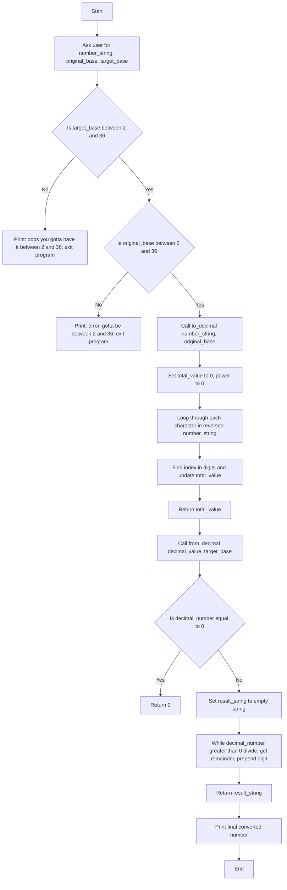

# The Hexorcist - Base Conversion Utility

A Python utility for converting numbers between different number bases (radixes) from base 2 to base 36.

## Features

- Convert numbers from any base (2-36) to any other base (2-36)
- Interactive command-line interface
- Support for hexadecimal, binary, octal, and all bases up to base-36
- Comprehensive test suite using pytest
- Clean, modular code structure

## Usage

### Interactive Mode

Run the script directly to use the interactive converter:

```bash
python3 hexthign.py
```

The program will prompt you to:
1. Enter the number you want to convert
2. Specify the current base of the number (2-36)
3. Specify the target base for conversion (2-36)

### As a Module

Import the functions into your own Python code:

```python
import hexthign

# Convert hexadecimal 'FF' to decimal
decimal_value = hexthign.to_decimal('FF', 16)  # Returns 255

# Convert decimal 255 to hexadecimal
hex_value = hexthign.from_decimal(255, 16)  # Returns 'FF'
```

## Functions

### `to_decimal(number_string, original_base)`
Converts a number from any base to decimal (base 10).

**Parameters:**
- `number_string` (str): The number to convert as a string
- `original_base` (int): The base of the input number (2-36)

**Returns:**
- `int`: The decimal representation of the number

**Example:**
```python
hexthign.to_decimal('1A', 16)  # Returns 26
hexthign.to_decimal('101', 2)  # Returns 5
```

### `from_decimal(decimal_number, target_base)`
Converts a decimal number to any base (2-36).

**Parameters:**
- `decimal_number` (int): The decimal number to convert
- `target_base` (int): The target base for conversion (2-36)

**Returns:**
- `str`: The number represented in the target base

**Example:**
```python
hexthign.from_decimal(26, 16)  # Returns '1A'
hexthign.from_decimal(5, 2)    # Returns '101'
```

## Base Support

This utility supports bases 2 through 36:
- **Base 2 (Binary):** Uses digits 0, 1
- **Base 8 (Octal):** Uses digits 0-7
- **Base 10 (Decimal):** Uses digits 0-9
- **Base 16 (Hexadecimal):** Uses digits 0-9, A-F
- **Base 36:** Uses digits 0-9, A-Z

## Examples

### Binary to Hexadecimal
```
Input: 1010 (base 2)
Output: A (base 16)
```

### Decimal to Binary
```
Input: 42 (base 10)
Output: 101010 (base 2)
```

### Base-36 Examples
```
Input: Z (base 36) = 35 (base 10)
Input: 10 (base 36) = 36 (base 10)
```

## Testing

Run the test suite with pytest:

```bash
python3 -m pytest hexthigntest.py -v
```

The test suite includes:
- Conversion from various bases to decimal
- Conversion from decimal to various bases
- Edge cases (zero, single digits, multi-digit numbers)

## Requirements

- Python 3.x
- pytest (for running tests)

## Installation

1. Clone or download the repository
2. Ensure Python 3 is installed
3. Install pytest if you want to run tests:
   ```bash
   pip install pytest
   ```

## File Structure

- `hexthign.py` - Main conversion utility with interactive interface
- `hexthigntest.py` - Test suite for the conversion functions
- `README.md` - This documentation file

## Error Handling

The program includes input validation:
- Base values must be between 2 and 36
- Invalid base values will display an error message and exit
- The program handles edge cases like converting zero

## Flowchart


## Contributing

Feel free to submit issues, fork the repository, and create pull requests for any improvements.

